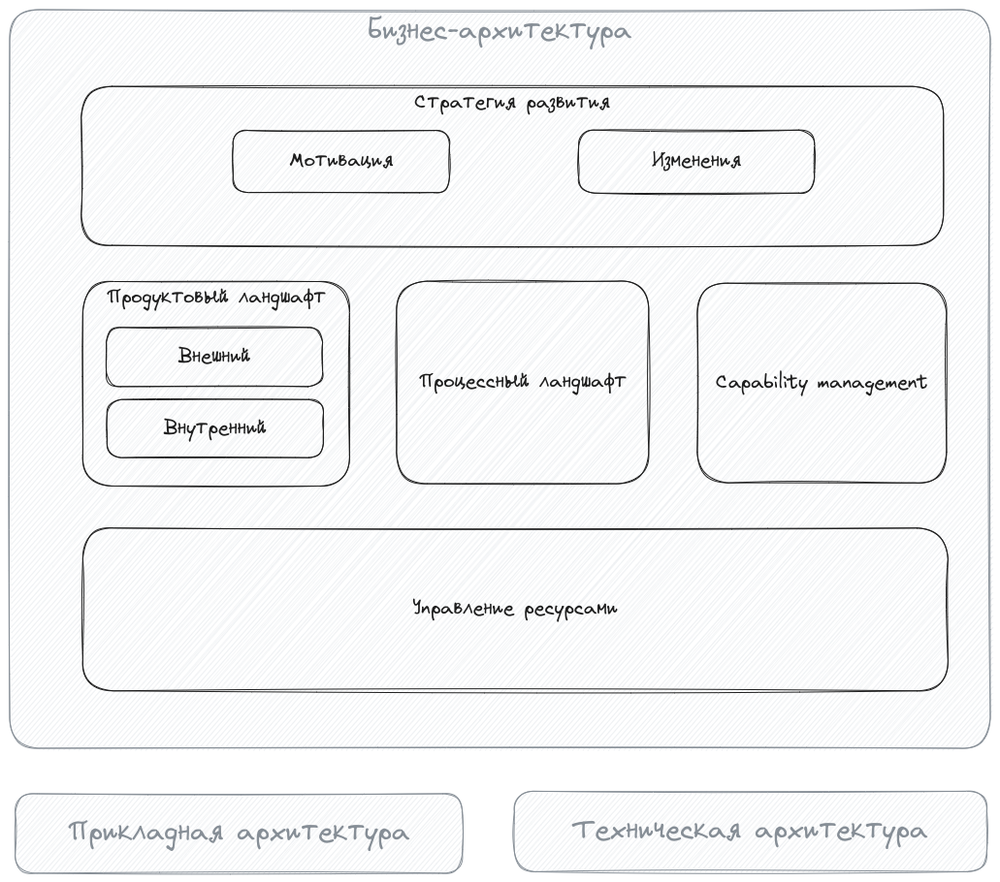

# Экосистемная архитектура

### Сообщество
Это DocHub-портал Cообщества специалистов, экспертов, занимающихся развитием и стабилизацией методологии описания архитектуры экосистем. Лучшие кейсы и решения будут продвигаться в рамках [SEAF](https://github.com/SEAFTeam/seaf-dzo) на широкую аудиторию.

DocHub-портал -- архитектурный инструмент, реализующий подход Architecture-as-Code (AaC). Подробнее https://dochub.info 

Сообщество ведет два Open Source репозитория с кодом архитектуры (оба подключены к данному порталу):
* [Методология](https://github.com/altershaman/eco_methodology)
* [Пример экосистемной архитектуры](https://github.com/altershaman/eco_architecture)

Группа Сообщества в Телеграм

### ЭКОСИСТЕМА, Экосистема, экосистема Участника, экосистемный подход

Человек как вид является частью природной **ЭКОСИСТЕМЫ** и, в отличие от других ее элементов наделен творческим мышлением и способностью создавать искусственное -- то, чего нет в природе, и поэтому может испытывать потребности и устанавливать цели, выходящие за рамки простого выживания в ЭКОСИСТЕМЕ.

Индивидуумы, группы и организации (далее Участники) создают, поддерживают и прекращают социально-экономические отношения с некоторым количеством других Участников (контрагентов), формируя в совокупности **Э**косистему (социально-экономическую подсистему ЭКОСИСТЕМЫ).

Каждый Участник, управляет, как минимум, своими социально-экономическими отношениями (см. рис а) с намерением преуспеть, то есть достичь целей и удовлетворить потребности. При этом Участник может принять во внимание и отношения между контрагентами (см. рис b), и постараться выявить и обратить в свою пользу эмерджентные свойства Экосистемы. Про последних будем говорить, что они:
* используют экосистемный подход
* строят свою **э**косистему вокруг себя

### Арх функция
Построение экосистемы в силу большего количества Участников и отношений, которые необходимо принять во внимание, в общем случае ведет к возрастанию сложности при принятии управленческих решений. Росту сложности компания может противопоставить развитие архитектурной функции.

Все Участники Экосистемы находятся на различных этапах своего жизненного цикла, и поэтому могут иметь различную потребность и уровень зрелости архитектурной функции. Понимая это, Сообщество не предполагает “единого” шаблона или алгоритма описания архитектуры для всех. Исходя из опыта, “правильной” точкой входа в описание архтитектуры и, особенно экосистемной архитектуры, является описание бизнес-окружения компании. Но, при этом не всегда разумно не использовать, например ИТ-ландшафт в качестве стартовой площадки, если она уже имеет описание.

Ниже приведена обобщенная схема различных аспектов архитектуры. 

Исходя из предложенных аспектов, будем формировать "сценарии" использования архитектурной функции для решения типовых управленческих задач:
* перечень будет уточняться и подвергаться рефакторингу, на данный момент имеется [тьюториал](/docs/ba_tutorial) по быстрому описанию бизнес-архитектуры, озватывающий некоторые основные сценарии
* будут разработаны требования к описанию сценариев
* общий план работ по реализации сценариев в DocHub будет вестись в виде роудмапа

---
##### Нормализация внешнего продуктового ландшафта
Задача: достижение согласованного видения внешних Продуктов

Пререквизиты: нет

Аспекты: Продуктовый ландшафт, Стратегия развития

Статус: Реализован с ограничениями;

todo: документация по модам 27.11

todo: документация по сценариям 30.11

---
##### Нормализация внутреннего продуктового ландшафта
Задача: достижение согласованного видения внутренних Продуктов

Пререквизиты: Нормализация внешнего продуктового ландшафта

Аспекты: Продуктовый ландшафт

Статус: Реализован с ограничениями; todo: представление "внутренние Владельцы", 25.11

---
##### Мэппинг человеческих ресурсов на Продукты
Задача: Определение достаточности квалифицированных сотрудников в продуктовых командах

Пререквизиты: Нормализация внешнего продуктового ландшафта, Нормализация внутреннего продуктового ландшафта

Аспекты: Продуктовый ландшафт, Управление Ресурсами

Статус: выявлена потребность, PoC: после Нормализация внутреннего продуктового ландшафта

---
##### Описание процессного ландшафта (реверс структуры BPMN)
Задача: Обеспечение гибкости и устойчивости функционирования бизнеса

Пререквизиты: Нормализация внешнего продуктового ландшафта, Нормализация внутреннего продуктового ландшафта

Аспекты: Процессный ландшафт, Продуктовый ландшафт

Статус: PoC, MVP: декабрь 2023

---
##### Построение цепочек ценности
Задача: Определение критичных ресурсов и их источников

Пререквизиты: Описание процессного ландшафта

Аспекты: Продуктовый ландшафт, Процессный ландшафт, Управление Ресурсами

Статус: MVP; todo: Производные связи Продукт-Ресурс, декабрь 2023

---
##### Описание мотиваций стейкхолдеров
Задача: Определение стратегии развития, KPI

Пререквизиты: Нормализация внешнего продуктового ландшафта 

Аспекты: Стратегия развития, Продуктовый ландшафт

Статус: MVP; todo: тестировать кейсы со стейкхолдерами-не потребителями, по мере выявления потребности

---
##### Управление изменениями
Задача: Планирование и контроль реализации Стратегии развития

Пререквизиты: Нормализация внешнего продуктового ландшафта, Нормализация внутреннего продуктового ландшафта, Capability Management

Аспекты: все

Статус: PoC; MVP после Описание мотиваций стейкхолдеров; todo: timeline (MVP), task management support(PoC)

---
##### Управление требованиями к автоматизации
Задача: Автоматизация

Пререквизиты: Процессный ландшафт, Нормализация внутреннего продуктового ландшафта, Управление изменениями

Аспекты: Процессный ландшафт, Управление Ресурсами, Прикладная архитектура

Статус: отложено

---
##### Клиентские пути
Задача: Лучший UX

Пререквизиты: Нормализация внешнего продуктового ландшафта, Описание процессного ландшафта

Аспекты: Процессный ландшафт

Статус: PoC 2024

---
##### Формирование карты способностей
Задача: Стандартизация и переиспользование

Пререквизиты: Построение цепочек ценности

Аспекты: Capability management

Статус: MVP; todo: дополнительная методологическая проработка, декабрь-январь

---

